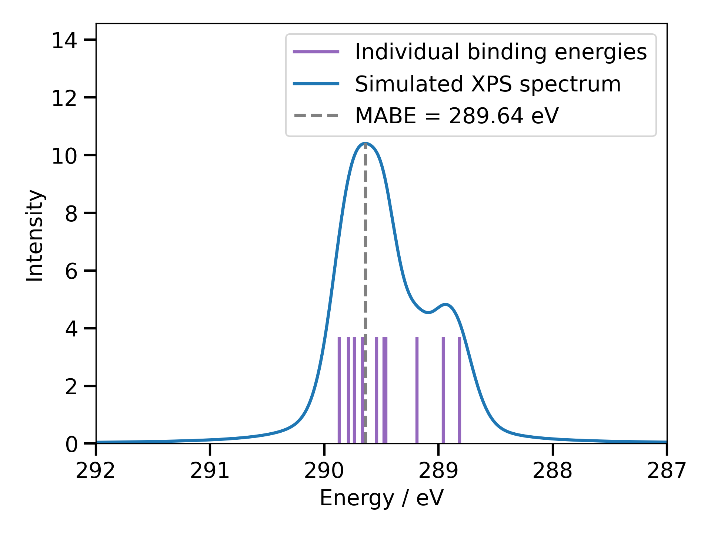

# deltaSCF-aims

An application to automate the calculation of core-level spectroscopy simulations in FHI-aims

[](https://github.com/maurergroup/deltascf-aims/actions/workflows/python-package.yml)
[](https://github.com/maurergroup/deltascf-aims/actions/workflows/dependency-review.yml)

## Requirements 

- [python pip](https://pypi.org/project/pip/)
- Access to an FHI-aims binary with the basis sets saved at `FHIaims/species_defaults`. Note that the `FHIaims/` top level directory can be at any writeable location in your filesystem as `deltaSCF-aims` will ask for the location of this.

## Installation

### PyPi

This package is available to download on PyPi. To install, simply execute 

``` shell
pip install deltascf-aims
```

And the binary should be available on your path as `deltascf`.

### Manual Installation 

Clone this repository by executing `git clone https://github.com/maurergroup/deltascf-aims`. The build processes is then automated using Poetry. To install poetry, it is possible to set up a virtual environment and install everything in that virtual environment. However, the recommended installation method is using [pipx](https://pipx.pypa.io/stable/), which automatically sets up a virtual environment for each installed library.

```shell
pipx install poetry
```

It is recommended to use [pyenv](https://github.com/pyenv/pyenv) to manage the local python version, however this is not essential. If this is desired, then simply install and set the local python version. You should also tell poetry the environment you wish to use to create a virtual environment. For example:

```shell
pyenv install 3.12.7
pyenv local 3.12.7
poetry env use 3.12
```

Then install the dependencies for deltaSCF-aims with

```shell
poetry install
```

Then either enter the poetry virtual environment with `poetry shell`, and use deltaSCF-aims, as described below, or prefix commands to deltaSCF-aims with `poetry run`. For more information on how to use Poetry, please refer to its [documentation](https://python-poetry.org/docs/).

## Usage
### General Overview

It is necessary to have a compiled FHI-aims binary before running anything with deltaSCF-aims. The location to the binary needs to be specified, which the application will prompt for automatically. The location will then be saved to avoid prompting for the location every time it is run. If you wish to change the binary name/location, simply invoke the app with the `-y/--binary` option.

deltaSCF-aims has a CLI that has been written using the [Click library](https://click.palletsprojects.com/en/8.1.x/) and can be run using 1 of 3 subcommands. These are `basis`, `projector`, and `plot`. The base deltaSCF-aims also has a variety of optional and some mandatory flags, which have to be supplied before specifying one of the subcommands. The mandatory flags are one of either `-e/--geometry_input` or `-m/--molecule`, and `-c/--constrained_atom`. `--geometry_input` is an FHI-aims `geometry.in` file, and `--molecule` takes a molecule name, formula, PubChem CID, or PubChem SMILES string, which it parses using the [ASE library](https://wiki.fysik.dtu.dk/ase/)

The following table provides a summary of all of the command line options 

| Option                                                     | Description                                                                                                                                                           |
|--------------------------------------------------------------|-----------------------------------------------------------------------------------------------------------------------------------------------------------------------|
| `-h, --hpc`                                                  | Setup a calculation without running the calculation. It is primarily for use on a HPC with batch job submission. This argument is mutually exclusive with: `--binary` |
| `-m, --molecule TEXT`                                        | Molecule name, formula, PubChem CID, or PubChem SMILES string to be used in the calculation. This argument is mutually exclusive with `--geometry_input`              |
| `-i, --control_input FILENAME`                               | Specify a custom geometry.in instead using a structure from pubchem or ASE. This argument is mutually exclusive with `--molecule`                                     |
| `-y, --binary`                                               | Invoke a prompt to modify the path to the FHI-aims binary. This argument is mutually exclusive with `--hpc`                                                           |
| `-r, --run_location DIRECTORY`                               | Optionally specify a custom location to run the calculation  `[default: ./]`                                                                                          |
| `-c, --constrained_atom TEXT`                                | Atom to constrain; constrain all atoms of this element. This argument is mutually exclusive with `--specific_atom_constraint`                                         |
| `-s, --specific_atom_constraint INTEGER RANGE`               | Specify specific atoms to constrain by their index in a geometry file                                                                                                 |
| `-o, --occupation FLOAT`                                     | Occupation value of the core hole `[default: 0.0]`                                                                                                                    |
| `-a, --n_atoms INTEGER RANGE`                                | Number of atoms to constrain per calculation `[default: 1; x>=1]`                                                                                                     |
| `-b, --basis_set [light\|intermediate\|tight\|really_tight]` | Basis set to use for the calculation `[default: tight]`                                                                                                               |
| `-x, --use_extra_basis`                                      | Use additional core-augmented basis functions in the calculations. Only a selection of elements is currently supported                                                |
| `-p, --print_output`                                         | Show the live output of the calculation                                                                                                                               |
| `-f, --force`                                                | Do not display an error message if the speficied calculation has already been run                                                                                     |
| `-n, --n_procs INTEGER `                                     | Number of processors to use for the FHI-aims calculation `[default: 4]`                                                                                               |

All of the command line options can also been viewed on the command line by running `deltascf` with the help flag:

```shell
deltascf --help
```

After specifying all of the desired base command options, one of the subcommands must be invoked. 

### Basis 

This sets up a `deltascf_basis` (the default) or the deprecated `force_occupation_basis` calculation in FHI-aims, in accordance with how they are described in the $\Delta$-SCF FHI-aims [tutorial](https://fhi-aims-club.gitlab.io/tutorials/core-level-with-delta-scf/index.html), and how `deltascf_basis` is documented in the manual.

When calling the `basis` subcommand, there are a number of additional required arguments. These are `-r/--run_type`, which is one of either `ground` or `hole` depending on whether a ground state or core hole calculation should be run, `-n`, `-l`, `-m`, which represent the quantum numbers of the orbital to manually set the occupation of, and `-k/--ks_max`, which is the maximum Kohn-Sham eigenstate the core-hole is allowed to occupy. Other optional flags are the `-s/--spin`, which can either be 1 or 2, and defaults to 1, for setting the occupation in the up or down spin channels, and `-o/--occ_type`, which controls whether `deltascf_basis` or `force_occupation_basis` is used by FHI-aims (`deltascf_basis` by default). 

The final optional argument is `-c/--control_opts`. This is a `key=value` pair of any additional options to pass into the FHI-aims control file. Naturally, it is completely infeasible to check all of the options that FHI-aims takes in its control file, so adding the correct options is at the discretion of the user, and will only be checked when FHI-aims is run. For FHI-aims keywords that take multiple strings for the `value`, single quotes can be put around the entire `value`.

All of these options can be viewed on the command line by calling the `--help` flag after the `basis` subcommand.

A minimal example of running a calculation with `basis` is given as follows:

``` shell
deltascf -m benzaldehyde -c C basis -r hole -n 1 -l 0 -m 0 -k 6
```

This would write the FHI-aims input files and run the 1s core-hole calculation for all of the C atoms in a benzaldehyde molecule using `deltascf_basis` with 4 CPU cores in the current directory, and automatically prompt the user for the location of the FHI-aims binary using their default editor if it was being executed for the first time after installation. Note that this command will error if deltaSCF-aims cannot find a directory called `ground` with a file called `aims.out` from the current directory. This would generated if the `ground` calculation was run before this.

A significantly more complex (and more realistic) example would be to run core-hole constrained calculations for one 2p orbital on all C atoms in the system with the user specifying their own geometry and control files, using addition core-hole augmented basis sets with an overall intermediate basis set, printing the live output of the calculation running on 8 CPU cores, whilst also adding the `spin none` and `relativistic atomic_zora scalar` keywords to the FHI-aims control file:

``` shell
deltascf -e geometry.in -i control.in -c C -b intermediate -x -p -n 8 basis -r hole -n 2 -l 1 -m 0 -k 6 -c spin=none -c 'relativistic=atomic_zora scalar'
```

### Projector 

This sets up a `deltascf_projector` (the default) or the deprecated `force_occupation_projector` calculation in FHI-aims, in accordance with how they are described in the $\Delta$-SCF FHI-aims [tutorial](https://fhi-aims-club.gitlab.io/tutorials/core-level-with-delta-scf/index.html), and how `deltascf_projector` is documented in the manual.

When calling the `projector` subcommand, there are a number of additional required arguments. These are `-r/--run_type`, which is one of `ground`, `init_1`, `init_2`, or `hole`. `ground` and `hole` perform the same as described in [Basis](#basis) section, and `init_1` and `init_2` are additional localisation steps that are often necessary to ensure convergence and localisation of the core-hole, as described in the [tutorial](https://fhi-aims-club.gitlab.io/tutorials/core-level-with-delta-scf/index.html). `init_1` sets up a calculation to run to SCF convergence with a nuclear charge of 0.1 on the atom where the core hole will be initialised but without constraining the occupation of any Kohn-Sham (KS) eigenstate, and writes wavefunction restart files for this. To maintain charge neutrality, and extra 0.1 electron is also added to the calculation. `init_2` sets up a calculation to run with only a single SCF iteration, with the core hole and the additional partial charge, from the restart files from the `init_1` calculation, and also writes wavefunction restart files after this single SCF step. Finally, when `hole` is run, the additional partial charge is removed, whilst keeping the core hole and the whole charge until the SCF cycle converges. The calculation is also initialised from the restart files from the `init_2` calculation.

On a practical note, when run without the `--hpc` flag, running `deltascf ... projector -r init_1 ...` also sets up the directories and files for the `init_2` and `hole` calculations, however these are not run until `... -r init_2 ...` and/or `... -r hole ...` are specified as arguments.

As it is possible to run periodic calculations with `projector`, there is a `-l/--latice_vectors` argument. The allows the user to specify lattice vectors in a 9x9 matrix by specifying 3 strings pertaining to lattice vector. If providing lattice vectors, it is also necessary to specify a Monkhorst-Pack k-grid, which can be done using the `-p/--pbc` option. `--pbc` takes 3 integers as arguments, corresponding to the number of k-points in the x, y, and z directions respectively. For example,

``` shell
deltascf -e geometry.in -i control.in -c C projector -r ground -l "0.0 1.76 1.76" "1.76 0.0 1.76" "1.76 1.76 0.0" -p 8 8 8
```

performs a ground state calculation from a user-defined geometry and control file, but with defining an FCC cell with lattice vectors of magnitude 2.489 in each direction, and sampling the first Brillouin zone with a total of 64 k-points (8 in each Cartesian direction).

The final options are `-s/--spin`, `-c/--control_opts`, and `-k/--ks_range`. `--spin` and `--control_opts` operate the same as described in [Basis](#basis), and `--ks_range` specifies the allowed range of KS eigenstates for the core-hole to move between. This is similar to the `--ks_max` for the `basis` command, but with the addition of a minimum value.

An example workflow for `projector` might look like

``` shell
deltascf -m ethyl-trifluoroacetate -c C -x -p -n 4 projector -c 'occupation_type=gaussian 0.1' -r ground 
...
deltascf -m ethyl-trifluoroacetate -c C -p -n 8 projector -k 1 4 -c 'occupation_type=gaussian 0.1' -r init_1
...
deltascf -m ethyl-trifluoroacetate -c C -p -n 8 projector -r init_2
...
deltascf -m ethyl-trifluoroacetate -c C -p -n 8 projector -r hole
```

### Plot

The `plot` subcommand is used for creating an XPS spectrum from a $\Delta$-SCF calculation by parsing, broadening, and plotting the XPS spectrum. The following summary of options for this is given in the table below 

| Option                         | Description                                                                                         |
|--------------------------------|-----------------------------------------------------------------------------------------------------|
| `-g, --graph`                  | Plot the simulated XPS spectra in addition to saving the spectrum to a file                         |
| `-A, --intensity FLOAT`        | Normalised intensity of the spectrum `[default: 1]`                                                 |
| `-s, --asym`                   | Include an asymmetry broadening parameter                                                           |
| `-a, --asym_param FLOAT`       | Define the asymmetry parameter [mutually inclusive with `--asym`] `[default: 0.2]`                  |
| `-b, --asym_trans_param FLOAT` | Define the asymmetry translation parameter [mutually inclusive with `--asym`] `[default: 0.0]`      |
| `-m, --gl_ratio FLOAT RANGE`   | Set the mixing parameter for the Gaussian-Lorentzian functions `[default: 0.5; 0<=x<=1]`            |
| `-o, --omega FLOAT RANGE`      | Full width at half maximum value `[default:0.35; 0<=x<=1]`                                          |
| `-i, --include_name`           | If possible, include the molecule name in the plot `[default: True]`                                |
| `-e, --exclude_mabe`           | Exclude the mean average binding energy from the plot `[default: Flase]`                            |
| `--gmp FLOAT RANGE`            | Set the minimum y-value to include in the plot (global minimum percentage) `[default: 0.003; x>=0]` |

This subcommand performs post-processing on the FHI-aims calculation and writes several files. The first is plain text file which contains a list of the calculated binding energies for each of the excited state calculations, calculated against the ground-state. The second is also plain text and contains the broadened spectrum. This is formatted into 2 columns; the first is the x-value, and the second is the intensity of the spectrum on the y-axis at this point. The final two are a pdf and png file of the broadened spectrum plotted, which are only produced if the `-g/--graph` flag is given. 



#### Broadening

The broadening is calculated using a Schmid-pseudo-Voigt function to broaden the spectrum with some tunable parameters, which were given in the table above. The formula for how the non-asymmetrical spectrum is calculated is

<!-- **Schmid-pseudo-Voigt broadening** -->
$$V = A(1-m) \sqrt{\frac{4 \ln(2)}{\pi \omega^2}} e^{-\frac{4 \ln(2)}{\omega^2}x^2} + Am \frac{1}{2\pi} \frac{\omega}{\left(\frac{\omega}{2}\right)^2 + x^2}$$

where $A$ is the intensity of the peak, $m$ is the Gaussian-Lorentzian mixing parameter, and $\omega$ is the full width at half maximum.[^1]

### References 

[^1]: M. Schmid, H.-P. Steinrück, J. M. Gottfried, *Surface and Interface Analysis*, **2014**, 46, 505–511. https://analyticalsciencejournals.onlinelibrary.wiley.com/doi/10.1002/sia.5521
